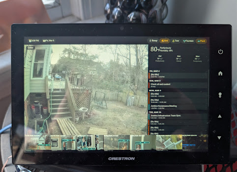

# Crestron HA Launcher

Display a Home Assistant dashboard on a Crestron TSW-1060 (or similar) touch panel — without killing the SD card.




## Just Want a Photo Frame?

If you don't use Home Assistant and just want to turn your Crestron panel into a digital photo frame, see **[photoframe-server](photoframe-server/)**. It's a standalone Docker container — point your panel at it and you're done.

```bash
# 1. Clone and start the server
cd photoframe-server
# Edit docker-compose.yaml — set your photos directory
docker compose up -d

# 2. Point your panel at it
#    EMS mode (simplest):
#      EMS <host-ip>:8099
#    Or UserProject mode:
#      BROWSEROPEN http://<host-ip>:8099
```

Full-screen photos with fade transitions, bouncing clock overlay, and optional weather (if you do have HA). No Home Assistant required.

---

## The Problem

Crestron TSW panels can display web pages in two ways:

- **EMS mode** — simple URL config, but aggressive disk caching generates 100K+ writes/hour, destroying the SD card
- **Browser (UserProject) mode** — cache can be disabled, but the panel insists on booting into a CH5 app, not a browser

The CH5 WebView has broken `localStorage` (returns `null`), which crashes Home Assistant's frontend JavaScript. The standalone browser works fine, but there's no way to auto-launch it on boot.

## The Solution

A minimal CH5 app that acts as a boot trigger:

1. Panel boots into the CH5 app (guaranteed by UserProject mode)
2. CH5 app fires a webhook to Home Assistant
3. HA automation SSH's into the panel and runs `BROWSEROPEN <url>`
4. The standalone browser opens with the full HA dashboard
5. `localStorage` works natively — no polyfills needed

The result: auto-launching HA dashboard, ~46K writes/hour (2.5% of the danger threshold), full JS support, and hardware side button access.

## Architecture

```
┌──────────────────┐         ┌──────────────────┐
│  Crestron Panel   │         │  Home Assistant   │
│                   │         │                   │
│  1. Panel boots   │         │                   │
│  2. CH5 app loads │─webhook─▶ 3. Automation     │
│                   │         │    triggers       │
│  5. Browser opens │◀──SSH───│ 4. shell_command  │
│     with HA       │         │    runs BROWSEROPEN│
│                   │         │                   │
│  6. Full HA       │         │                   │
│     dashboard!    │         │                   │
└──────────────────┘         └──────────────────┘
```

## Prerequisites

- Crestron TSW-1060 (or similar TSW panel) with network access
- Home Assistant instance on the same network
- Node.js (for building the CH5 app)
- SSH access to your HA host (for deploying scripts)

## Setup

### Step 1: Deploy the SSH Script to Home Assistant

This Python script uses `paramiko` to send console commands to the panel via SSH. Install it if your HA environment doesn't already have it:

```bash
pip install paramiko
```

Copy `ha-scripts/crestron_cmd.py` to your HA config directory:

```bash
# If HA config is at /config/ inside the container:
cp ha-scripts/crestron_cmd.py <ha-config-path>/scripts/crestron_cmd.py
```

Edit the defaults at the top of the script to match your panel:

```python
HOST = os.environ.get("CRESTRON_HOST", "192.168.1.58")    # your panel IP
USER = os.environ.get("CRESTRON_USER", "admin")            # console username
PASS = os.environ.get("CRESTRON_PASS", "admin")            # console password
```

Test it:

```bash
# From inside the HA container:
python3 /config/scripts/crestron_cmd.py "ver"
```

You should see the panel's firmware version.

### Step 2: Configure the Crestron Panel

The panel setup script (`ha-scripts/panel-setup.sh`) configures the TSW-1060 for optimal dashboard use via SSH. It requires `crestron_cmd.py` to be deployed first (Step 1).

```bash
# Run from the HA host (adjust the config path to match your setup):
./ha-scripts/panel-setup.sh /config

# Or for non-container installs:
./ha-scripts/panel-setup.sh /export/homeassistant
```

The script configures the following settings (reboot required after):

#### Core Settings

| Command | Value | Purpose |
|---------|-------|---------|
| `BROWSERCACHE` | `DISABLE` | Prevents aggressive SD card caching (~100K writes/hour) |
| `APPKEYS` | `ON` | Enables hardware side buttons as JavaScript key events in the browser |
| `DEDICATEDVIDEOSUPPORT` | `DISABLE` | Kills `txrxservice` (AV transport) — saves a full CPU core even with nothing connected |
| `CAMERASTREAMENABLE` | `OFF` | Kills onboard camera driver + `mediaserver` — saves ~70 min CPU time per hour |
| `TIMEZONE` | `014` | Eastern Time (edit script for your timezone; run `TIMEZONE list` for codes) |

#### Memory Management

| Command | Value | Purpose |
|---------|-------|---------|
| `PROJECTMEMORY` | `512` | MB limit for the browser project — prevents runaway memory consumption |
| `MEMCLEANUPCONFIG APP` | `3600` | Runs memory cleanup every 60 minutes |
| `MEMLOWTRIG` | `80` | Schedules reboot when free RAM drops below 80 MB |
| `MEMCRITTRIG` | `30` | Immediate reboot when free RAM drops below 30 MB |
| `MEMTRIGTIME` | `6` | Memory-triggered reboots happen at 6 AM |
| `PERIODICREBOOT` | `ON` | Daily reboot at the configured hour |

#### Display Settings

| Command | Value | Purpose |
|---------|-------|---------|
| `AUTOBRIGHTNESS` | `ON` | Adjusts screen brightness based on ambient light |
| `STBYTO` | `0` | Disables standby timeout (panel stays on) |
| `SCREENSAVER` | `OFF` | Disables built-in screensaver (handled by `crestron-panel.js`) |

#### Browser Settings

| Command | Value | Purpose |
|---------|-------|---------|
| `BROWSERSELECT` | `WEBVIEW` | Required on TSW-1060 — Chromium renders blank pages |
| `BROWSERMOBILE` | `DESKTOP` | Desktop user agent for proper HA rendering |
| `BROWSERHOMEPAGE` | `<HA_URL>` | Sets the browser home page to your HA dashboard |
| `BEEPSTATE` | `OFF` | Disables key click sounds |

> **Note:** `PROJECTMODE`, `BROWMODE`, and `SDCARDCOUNTER` cannot be set via SSH. Configure these from the panel's local console:
> ```
> PROJECTMODE USERPROJECT
> BROWMODE KIOSK
> SDCARDCOUNTER ON
> REBOOT
> ```

### Step 3: Configure Home Assistant

Add to your `configuration.yaml`:

```yaml
# Shell commands for Crestron panel control
shell_command:
  crestron_open_browser: "python3 /config/scripts/crestron_cmd.py 'BROWSEROPEN http://<HA_IP>:8123/crestron-display/home'"
  crestron_close_browser: "python3 /config/scripts/crestron_cmd.py 'BROWSERCLOSE'"
  crestron_standby: "python3 /config/scripts/crestron_cmd.py 'standby'"
  crestron_wake: "python3 /config/scripts/crestron_cmd.py 'standby off'"
  photoframe_build_list: "python3 /config/scripts/photoframe_build_list.py"

# Camera cycling helper
input_select:
  camera_selector:
    name: Camera Selector
    icon: mdi:cctv
    options:
      - camera.frontporch
      - camera.driveway
      - camera.backyard
      - camera.critter
      - camera.armory
      - camera.pancam
      - camera.gatetown

# Load the panel controller JS
frontend:
  extra_js_url_es5:
    - /local/crestron-panel.js

# Allow iframe embedding and trust Docker network proxy
http:
  use_x_frame_options: false
  use_x_forwarded_for: true
  trusted_proxies:
    - 127.0.0.1
    - "::1"
    - 172.19.0.0/16    # Docker bridge network — needed for trusted_networks auth
```

If you want the panel to auto-login without credentials, add trusted_networks auth:

```yaml
homeassistant:
  auth_providers:
    - type: trusted_networks
      trusted_networks:
        - <PANEL_IP>/32       # e.g. 192.168.1.58/32
      allow_bypass_login: true
    - type: homeassistant     # keep normal login for other devices
```

See `ha-scripts/configuration-additions.yaml` for the full reference config.

### Step 4: Create the HA Automations

Add the automations from `ha-scripts/automations-crestron.yaml` to your automations (via YAML or the HA UI). These handle:

1. **Boot trigger** — CH5 app fires webhook, HA opens the browser
2. **Periodic browser restart** — every 6 hours, fully restart the browser to clear memory
3. **Camera cycling** — advances the camera selector every 15 seconds
4. **Photo frame image list** — rebuilds on HA startup and every hour

### Step 5: Build and Deploy the CH5 App

```bash
# Install dependencies
npm install

# Build the CH5 archive
npm run archive

# Deploy to the panel
npx --package=@crestron/ch5-utilities-cli ch5-cli deploy \
  -p -H <PANEL_IP> -t touchscreen archive/crestron-ha-launcher.ch5z
```

The panel will reboot. When the CH5 app loads, it shows a setup wizard. Enter your HA URL and webhook ID, tap **Launch**, and the browser will open with your dashboard.

On subsequent reboots, the app remembers your settings (stored in IndexedDB) and fires the webhook automatically.

## SD Card Health

Monitor write rates from the panel console:

```
SDCARDSTATUS
```

Run it twice, 10 seconds apart, and compare `Current Boot Counter`. Typical results:

| State | Writes/sec | Writes/hour | % of max |
|-------|-----------|-------------|----------|
| Idle (no browser) | ~3-4 | ~12K | 0.7% |
| HA dashboard loaded | ~13 | ~46K | 2.5% |
| EMS mode (bad) | ~30+ | ~100K+ | 5.5%+ |
| **Danger threshold** | — | **1.8M** | **100%** |

With `BROWSERCACHE DISABLE`, write rates stay well within safe limits.

## Dashboard

The `ha-scripts/` directory includes dashboard layouts designed for the TSW-1060 (1280x800). Multiple iterations exist, reflecting the evolution from HA-native cards to a lightweight single-page approach.

### Dashboard Versions

All versions are in `ha-scripts/` and can be used by creating an HA dashboard and pasting the YAML into the raw editor.

| Version | File | Layout | Key Ideas |
|---------|------|--------|-----------|
| **Lite** | `dash-lite.yaml` + `panel-lite.html` | Single vanilla JS page, zero sub-iframes | Lightest weight, best stability. Dashboard + screensaver in one file. |
| v6 | `dash-v6.yaml` | 2-column grid (camera + info), 3 iframes | Periodic `?reload=900` on all iframes for memory management |
| v5 | `dash-v5.yaml` | 3-column (camera + controls + calendar) | Mushroom entity cards for device control, Reddit-inspired blocky UI |
| v4 | `dash-v4.yaml` | 2-column grid, 3 iframes | First stable iframe-based layout, base for v6 |
| v3 | `dash-v3.yaml` | Grid with mushroom chips + stacked cards | Weather forecast + calendar in right column |
| v2 | `dash-v2.yaml` | Grid with entity cards | Larger device controls, experimental layout |
| v1 | `dash-v1.yaml` | Basic conditional camera cards | Original `picture-entity` cycling, no iframes |

**Other HTML components** (used by v4-v6):

| File | Purpose |
|------|---------|
| `camera-panel.html` | Camera snapshot viewer, syncs with `input_select`, image preloading with null-out |
| `calendar-panel.html` | 7-day calendar, 6 color-coded calendars, signed HA REST API calls |
| `detection-strip.html` | 7 Frigate person detection thumbnails with relative timestamps |
| `photoframe.html` | Photo frame screensaver with crossfade, clock, weather, forecast overlay |
| `photoframe-lite.html` | Stripped-down screensaver: single ``, no blur, no drift animation |
| `camera-viewer.html` | Experimental standalone camera viewer (not used by any dashboard) |
| `crestron-dashboard.html` | Early standalone dashboard prototype (not used by any dashboard) |
| `crestron-sidekeys.example.js` | Minimal side button example: navigate, service, fire actions |

### Panel Lite (Recommended)

A single HTML page that renders the entire dashboard and screensaver in one document — no HA card framework, no sub-iframes, no WebSocket subscription firehose. Designed for maximum stability on Chromium 95.

**Dashboard layout** (1280×800, 3 rows):

| Row | Content | Height |
|-----|---------|--------|
| 1 | Chips bar — clock, date, entity states | 54px fixed |
| 2 | Camera snapshot (2/3 width) + weather/calendar sidebar (1/3 width) | Fills remaining space |
| 3 | Detection strip — 7 Frigate person thumbnails | 120px fixed |

**Features:**

- **Camera snapshots** — cycles through 7 cameras via `input_select.camera_selector`, 3-second refresh, preloads next image before swap to avoid flicker
- **Weather + 3-day forecast** — current conditions with high/low temperatures, pulled from HA weather entity via REST API
- **Calendar** — 7-day lookahead across 6 calendars, color-coded by calendar, fetched via HA REST API with signed URLs
- **Detection strip** — last 7 person detections across all cameras (not per-camera), fetched from Frigate's event API via photoframe-server proxy, 30-second polling
- **Chips bar** — time, date, and entity states (thermostat, locks, etc.) as read-only display chips
- **Photo frame screensaver** — activates after 2 minutes idle, single `` tag (no crossfade), bouncing clock overlay for anti-burn-in
- **Side button handling** — hardware buttons cycle cameras, toggle screensaver, standby panel, return to dashboard (uses `e.code` — see button map above)
- **Standalone WebSocket** — single persistent connection for entity state updates; reconnects automatically on disconnect
- **Photo frame screensaver** — fetches random photos from the [photoframe-server](photoframe-server/) via `/random` endpoint. No file lists or naming conventions — just drop images in a folder
- **External config file** — secrets (HA_TOKEN), URLs, entity lists, and timing in a separate `panel-lite-config.js` that survives HTML updates
- **Periodic full-page reload** — opt-in via `?reload=900` URL param; does a full `location.href` reassignment, tearing down the entire document and reclaiming all leaked memory. Not needed in current soak tests
- **Debug overlay** — append `#debug` to URL (Crestron-safe; `?debug=1` also works from regular browsers)

**What it eliminates vs HA-native dashboards:**

- HA frontend framework (Polymer/Lit, ~20MB JS heap)
- Multiple iframes (v4-v6 used 3 separate document contexts)
- HACS custom components (mushroom, layout-card, card-mod)
- `state_changed` event subscription firehose (uses targeted polling and REST instead)
- `backdrop-filter: blur()` and continuous CSS animations (GPU killers on Chromium 95)
- Decoded image bitmap accumulation (explicit null-out of `img.src` via 1×1 data URI before reassignment)

**Side button mapping (Panel Lite):**

| Button | Icon | `e.code` | Action |
|--------|------|----------|--------|
| 1 (top) | Power | `BrowserBack` | Standby (`shell_command.crestron_standby`) |
| 2 | Home | `Home` | Return to dashboard |
| 3 | Up arrow | `AudioVolumeUp` | Next camera |
| 4 | Lightbulb | `AudioVolumeMute` | Toggle screensaver |
| 5 (bottom) | Down arrow | `AudioVolumeDown` | Previous camera |

> **Note:** TSW-1060 hardware buttons set `e.code` but `e.key` is null. The button handler checks `e.code` first, falling back to `e.key` for regular browsers.

**Deploy:**

```bash
# 1. Copy panel-lite to HA
cp ha-scripts/panel-lite.html <ha-config-path>/www/panel-lite.html

# 2. Create the config file from the example
cp ha-scripts/panel-lite-config.js.example <ha-config-path>/www/panel-lite-config.js
# Edit panel-lite-config.js — set HA_TOKEN (long-lived access token)
# Optionally set HA_URL, PHOTOFRAME_URL, entity lists, and timing

# 3. Deploy the photoframe server (see photoframe-server/README.md)
cd photoframe-server && docker compose up -d
```

Configuration is split into two files:

| File | Purpose | Redeploy frequency |
|------|---------|-------------------|
| `panel-lite-config.js` | Secrets (HA_TOKEN), URLs, entity lists, timing | Once (edit on server) |
| `panel-lite.html` | All dashboard/screensaver logic | As often as needed |

This separation means you can update `panel-lite.html` freely without losing your token or config. The config file is gitignored (contains secrets); use `panel-lite-config.js.example` as a template.

Open the panel at: `http://<HA_IP>:8123/local/panel-lite.html`

Or set it as the browser home page on a Crestron panel:
```
BROWSERHOMEPAGE http://<HA_IP>:8123/local/panel-lite.html
```

**Debug mode:** Append `#debug` to the URL to show the debug overlay. This uses a URL hash instead of query params because Crestron's `BROWSEROPEN` command mangles `=` and `&` characters.

```
BROWSEROPEN http://<HA_IP>:8123/local/panel-lite.html#debug
```

### HA-Native Dashboards (v5/v6)

These use the standard HA card framework with `custom:grid-layout` and iframe cards for camera, calendar, and detection strip. They require HACS components: `layout-card`, `mushroom`, `card-mod`.

**Deploy (v6 example):**

```bash
cp ha-scripts/crestron-panel.js <ha-config-path>/www/crestron-panel.js
cp ha-scripts/camera-panel.html <ha-config-path>/www/camera-panel.html
cp ha-scripts/calendar-panel.html <ha-config-path>/www/calendar-panel.html
cp ha-scripts/detection-strip.html <ha-config-path>/www/detection-strip.html
cp ha-scripts/photoframe.html <ha-config-path>/www/photoframe.html
cp ha-scripts/photoframe_build_list.py <ha-config-path>/scripts/photoframe_build_list.py
```

Create a dashboard with URL `crestron-v6` and paste `dash-v6.yaml` into the raw editor.

`crestron-panel.js` handles idle detection, screensaver navigation, and side buttons for v5/v6. It's loaded globally via `frontend > extra_js_url_es5` but only activates on matching dashboard paths. **Not needed for Panel Lite** (which handles everything internally).

### Common Setup

All dashboard versions require:

1. Merge `ha-scripts/configuration-additions.yaml` into your `configuration.yaml`
2. Add automations from `ha-scripts/automations-crestron.yaml`
3. Create the `input_select.camera_selector` helper with your camera entity IDs
4. Add photos to `/media/ciriolisaver/` (or change path in `photoframe_build_list.py`)
5. Restart HA

### WebView Stability

> **Note:** These constraints apply to the **CH5 WebView**. Standalone Chromium (via `BROWSEROPEN`) is significantly more stable — see [Lessons Learned](#lessons-learned) below.

The TSW-1060 runs Chromium 95 on Android 5.1 with ~1.7GB RAM and a 4-core ARM SoC. The CH5 WebView shares memory with the CrashpadMain and CH5 runtime processes, making it severely resource-constrained. It will crash-loop if overloaded. The following constraints were discovered through extensive soak testing (6+ hour runs with `TASKSTAT` monitoring).

**Hard constraints:**

- **No live video** — MJPEG, WebRTC, jsmpeg, and go2rtc all crash-loop the WebView within ~20 minutes. JavaScript video decode saturates the CPU. Only JPEG snapshot polling is viable.
- **No expensive CSS** — `backdrop-filter: blur()` and continuous CSS transform animations (`@keyframes drift`) consume GPU resources that Chromium 95 on Android 5.1 can't spare.
- **No HA frontend framework** — Polymer/Lit loads ~20MB of JS heap at startup. Combined with custom cards (mushroom, layout-card), this pushes the WebView past its limits within hours.
- **Memory leaks are unavoidable** — Chromium 95 leaks decoded image bitmaps even when `img.src` is reassigned. Setting `img.src` to `''` does NOT free the bitmap — you must use a 1×1 data URI. Even with this mitigation, heap grows over hours and requires periodic full-page teardown.

**What didn't work (and why):**

| Approach | Failure Mode | Time to Crash |
|----------|-------------|---------------|
| **MJPEG streams** (`camera_view: live`) | CPU saturation from JS MJPEG decode; `generalweb` process hits 50+ min CPU time | ~20 min |
| **go2rtc / WebRTC card** | Connection failures — DNS resolution and auth issues in WebView context | Immediate |
| **advanced-camera-card** (Frigate integration) | Even in snapshot mode, the card's JS overhead caused crash-loops | ~4–6 hours |
| **Multiple iframes** (v4-v6 layout) | 3 separate document contexts (camera, calendar, detections) multiplied memory pressure | ~6–12 hours |
| **Photoframe with crossfade** | Two `` tags simultaneously loaded + `backdrop-filter: blur(8px)` + CSS drift animation | ~2–4 hours on screensaver |
| **HA native dashboard** (Lovelace cards) | Polymer/Lit framework + mushroom + card-mod + state subscriptions | ~8–12 hours |
| **C3DEBUG at max verbosity** | All 32 debug masks ON (`C3DLEVEL 0xFFFFFFFF`) flooded syslog, contributed to instability | Compounded other issues |

**What fixed it:**

| Fix | Impact |
|-----|--------|
| `DEDICATEDVIDEOSUPPORT DISABLE` | Kills `txrxservice` (AV transport) — saved a full CPU core even with nothing connected (was burning 177 min CPU time) |
| `CAMERASTREAMENABLE OFF` | Kills onboard camera driver + `mediaserver` — saved ~70 min CPU/hour |
| `C3DLEVEL 0` at boot | Disables Core 3 debug logging — eliminated syslog flood |
| Panel Lite (single HTML, no framework) | Replaced HA frontend with vanilla JS — JS heap starts at ~10MB vs ~20MB |
| Single `` screensaver | Replaced dual-image crossfade with single swap — no simultaneous decoded bitmaps |
| 15-minute full page reload | `location.href = url` tears down entire document, reclaiming all leaked memory |
| Snapshot polling (not subscriptions) | REST API calls on timers instead of WebSocket `state_changed` firehose |

**Healthy baseline** (after all fixes):

```
CPULOAD: ~30% busy, load ~1.0
RAMFREE: ~800 MB free
TASKSTAT: chromium.chrome at 0:03, no CrashpadMain process
```

## Screensaver Stability Safeguards

> **Note:** These safeguards were developed for the CH5 WebView. On standalone Chromium they are optional — standard browser patterns work correctly. See [Lessons Learned](#lessons-learned).

The standalone screensaver (`ha-scripts/screensaver.html`) is designed for multi-day unattended operation on the TSW-1060's constrained Chromium 95 WebView. Every design decision prioritizes memory safety over features.

### Photo Loading

| Safeguard | Why |
|-----------|-----|
| **Self-scheduling `setTimeout` chain** | Only one image load is ever in flight. Each cycle schedules the next only after completing (success, error, or timeout). `setInterval` fires on a fixed clock regardless of completion — on slow ARM hardware this stacks up overlapping loads that leak decoded bitmaps. |
| **8-second timeout guard** | If an image doesn't load in 8s, the load is abandoned — handlers are nulled and `src` is set to BLANK. Prevents hung connections from blocking the chain. |
| **Handler cleanup on all code paths** | `onload`, `onerror`, and the timeout guard all null both handlers and set `src` to the 1x1 data URI. No code path leaves a handler attached or a decoded bitmap in memory. |
| **`oldFront` capture before swap** | The crossfade cleanup callback captures a reference to the current front element before `ssFront` is swapped. Without this, the closure would clean up the wrong element. |
| **1x1 data URI for bitmap release** | Chromium 95 does not free decoded image bitmaps when `img.src = ''` — you must assign a tiny valid image. The BLANK constant is a 1x1 transparent GIF. |
| **1.6s cleanup delay** | The old image is blanked 1.6s after the new one fades in, allowing the CSS transition to complete before the bitmap is released. |

### XHR Data Chips

| Safeguard | Why |
|-----------|-----|
| **Self-scheduling `setTimeout` chain** | Chip fetches run on a 2-minute self-scheduling chain, not `setInterval`. Same overlap-prevention rationale as photos. |
| **`abort()` before re-fetch** | All in-flight XHRs from the previous cycle are aborted before starting new ones. Prevents duplicate requests if the server is slow. |
| **Handler cleanup after completion** | `onload`, `onerror`, and `ontimeout` are all nulled after firing, regardless of HTTP status. Helps GC on Chromium 95. |
| **8-second XHR timeout** | Prevents hung connections from accumulating. |
| **`textContent` only** | No `innerHTML`, no DOM node creation or destruction. Just plain text assignment to pre-existing elements. |

### Bounce Animation

| Safeguard | Why |
|-----------|-----|
| **CSS `transform: translate()` instead of `left`/`top`** | Transform is GPU-composited and does not trigger layout reflow. The old approach (`style.left`/`style.top`) forced 86,400 reflows per day. |
| **`will-change: transform`** | Hints the compositor to promote the overlay to its own layer, avoiding repaints of the photo layers underneath. |
| **Cached overlay dimensions** | `offsetWidth`/`offsetHeight` (which force layout reflow) are measured on a separate 10-second timer, not every bounce tick. |
| **Self-scheduling `setTimeout`** | Even the 1-second bounce tick uses `setTimeout`, not `setInterval`. |

### General Architecture

| Safeguard | Why |
|-----------|-----|
| **Zero `setInterval` in the entire file** | Every recurring operation uses self-scheduling `setTimeout`. This is the single most important stability pattern for this hardware. |
| **All DOM elements cached at init** | No `getElementById` in any recurring function. Element references are stored in variables at startup. |
| **No WebSocket** | All data comes via simple XHR to the photoframe-server, which caches HA data server-side. No persistent connection to leak or reconnect. |
| **No JSON parsing** | Photoframe-server returns pre-formatted plain text. The panel just assigns `textContent`. |
| **No `innerHTML`** | No DOM node creation or removal at runtime. The entire DOM is 2 `` elements + 1 overlay div with 5 child divs. |
| **No error recovery / reload logic** | If something truly breaks, a frozen screen is safer than a crash-loop. The panel's `MEMLOWTRIG` / `PERIODICREBOOT` settings handle hard recovery. |
| **No `console.log`** | Avoids any logging overhead on the constrained device. |
| **IIFE with `'use strict'`** | Prevents accidental globals and catches silent errors. |

## Side Buttons

With `APPKEYS ON`, the TSW-1060's five hardware side buttons fire standard JavaScript key events directly in the browser. No Node-RED or external tools needed.

### Discover Key Codes

Copy the key test page to your HA `www/` folder:

```bash
cp utils/keytest.html <ha-config-path>/www/keytest.html
```

Open `http://<HA_IP>:8123/local/keytest.html` on the panel and press each button. TSW-1060 key codes:

| Position | Icon | `e.code` | `e.key` |
|----------|------|----------|---------|
| 1 (top) | Power | `BrowserBack` | `Unidentified` |
| 2 | Home | `Home` | `Unidentified` |
| 3 | Up arrow | `AudioVolumeUp` | `Unidentified` |
| 4 | Lightbulb | `AudioVolumeMute` | `Unidentified` |
| 5 (bottom) | Down arrow | `AudioVolumeDown` | `Unidentified` |

> **Important:** On the TSW-1060, hardware buttons set `e.code` but `e.key` is always `Unidentified` (null in some contexts). Always use `e.code` for button mapping, not `e.key`.

### Panel Controller (crestron-panel.js)

The panel controller handles side buttons, idle detection, camera cycling, and WebView memory management in one script. It activates on `crestron-display` and `crestron-v6` dashboards (guard clause) — inert on all other devices. **Not needed for Panel Lite** (which handles everything internally).

Default button mapping (uses `e.code`):

| Button | `e.code` | Action |
|--------|----------|--------|
| Power / Home | `BrowserBack` / `Home` | Return to dashboard |
| Up arrow | `AudioVolumeUp` | Next camera (via `input_select.select_next`) |
| Down arrow | `AudioVolumeDown` | Previous camera (via `input_select.select_previous`) |
| Lightbulb | `AudioVolumeMute` | Toggle photo frame |

Deploy: copy to `www/crestron-panel.js` and add to `configuration.yaml` under `frontend > extra_js_url_es5`.

### Simple Version (example)

If you just want basic button-to-service mapping without idle detection or camera cycling, see `ha-scripts/crestron-sidekeys.example.js`. This is a minimal standalone script with three action types: **navigate**, **service**, and **fire**.

## Changing the HA URL

To change the HA URL or webhook ID after initial setup, close the browser to get back to the CH5 app:

```
BROWSERCLOSE
```

The CH5 setup wizard will be visible. Tap **Reconfigure**, enter the new URL, and tap **Launch**.

## Diagnostic Commands

These can be run anytime via `crestron_cmd.py` to check panel health:

| Command | Purpose |
|---------|---------|
| `RAMFREE` | Check free memory (healthy: ~800 MB free) |
| `CPULOAD` | Check CPU usage (healthy: ~30% busy, load ~1.0) |
| `TEMPERATURE` | Check panel temperature |
| `SDCARDSTATUS` | Check SD card write counters |
| `UPTIME` | Check how long since last reboot |
| `TASKSTAT` | Show per-process CPU time (useful for finding runaway services) |

## Network Architecture

The system uses three hosts on the LAN, with the Crestron panel connecting to HA and the photoframe server:

```
┌─────────────────────┐
│  Crestron TSW-1060   │
│  192.168.1.58        │
│                      │
│  Loads panel-lite    │───────┐
│  from HA :8123       │       │
│  Photos from :8099   │──┐    │
│  Detections via :8099│──┤    │
└─────────────────────┘  │    │
                          │    │
┌─────────────────────┐  │    │  ┌─────────────────────┐
│  HA Host             │  │    │  │  Frigate Host        │
│  192.168.1.245       │  │    │  │  192.168.1.207       │
│                      │◀─┘    │  │  (ardbeg)            │
│  :8123  HA (host net)│◀──────┘  │                      │
│  :8099  photoframe   │─────────▶│  :5000  Frigate API  │
│  :80    nginx → HTTPS│          │                      │
│  :443   nginx (ext)  │          └─────────────────────┘
│  :1883  mosquitto    │
└─────────────────────┘
```

### Services on the HA Host (192.168.1.245)

| Service | Port | Network Mode | Purpose |
|---------|------|-------------|---------|
| Home Assistant | 8123 | host | Dashboard, automations, WebSocket API |
| photoframe-server | 8099 | bridge | Screensaver photos (`/random`) and Frigate API proxy (`/frigate/*`) |
| nginx | 80, 443 | bridge | HTTPS reverse proxy for external access (`cirioli.duckdns.org`) |
| Mosquitto | 1883 | host | MQTT broker (Frigate events, device integrations) |
| Watchtower | — | bridge | Auto-updates container images |

### External Access

The nginx reverse proxy handles external (internet) access:

- `https://cirioli.duckdns.org/` → HA (with WebSocket upgrade for app)
- Port 80 redirects to HTTPS
- Frigate is **not** exposed externally (no authentication). Use VPN for remote Frigate access.

### Data Flow: Detection Strip

The detection strip avoids CORS issues by proxying Frigate through the photoframe server:

```
Panel (8123 origin) ──XHR──▶ photoframe:8099/frigate/api/events ──▶ Frigate:5000/api/events
                                        (CORS: Access-Control-Allow-Origin: *)
Panel ◀──── JSON event list (id, camera, start_time)

Panel ────▶ photoframe:8099/frigate/api/events/<id>/thumbnail.jpg ──▶ Frigate:5000
                                        (images exempt from CORS, but proxy keeps it simple)
```

### Data Flow: Boot Sequence

```
Panel boots → CH5 app → webhook → HA automation → SSH → BROWSEROPEN panel-lite.html
                                                         │
Panel loads panel-lite-config.js (HA_TOKEN, URLs)        │
Panel opens WebSocket to HA :8123 (entity states)        │
Panel polls photoframe :8099/frigate/* (detections)      │
Panel polls photoframe :8099/random (screensaver)        ▼
```

## Troubleshooting

**URL params don't work from BROWSEROPEN**
- Crestron's `BROWSEROPEN` console command mangles `=` to `-` and `&` to `\&`. URL query params (`?key=value`) will not work. Use `#hash` fragments or external config files instead.

**Panel shows CH5 setup wizard but browser never opens**
- Test the webhook manually: `curl -X POST http://<HA_IP>:8123/api/webhook/crestron-open-browser`
- Check HA logs for shell_command errors
- Verify SSH works: `python3 /config/scripts/crestron_cmd.py "ver"`

**Browser opens but HA shows login screen (trusted_networks not working)**
- Add your Docker bridge network to `trusted_proxies` (see Step 3)
- Check HA logs for "untrusted proxy" errors
- Verify the panel IP is in your `trusted_networks` list

**High SD card write rate**
- Verify cache is off: `BROWSERCACHE` in the panel console
- Check `SDCARDSTATUS` — `Current Boot Counter` should grow slowly

**SSH script fails with "Error: Authentication failed"**
- Verify panel credentials: try SSH manually from the HA container
- Check that the panel's SSH server is enabled

**Panel freezes after ~20 minutes**
- Check `TASKSTAT` for high CPU time on `txrxservice`, `mediaserver`, or `CrashpadMain`
- Run `DEDICATEDVIDEOSUPPORT DISABLE` and `CAMERASTREAMENABLE OFF`, then `REBOOT`
- Verify cameras use snapshot mode (`camera_view: auto`), not live streams
- The 15-min refresh timer in `crestron-panel.js` mitigates WebView memory leaks

**Camera not cycling**
- Verify `input_select.camera_selector` exists (**Settings > Helpers**)
- Verify the cycling automation is enabled (**Settings > Automations**)
- Check that the dashboard YAML has conditional cards matching the input_select states

## Lessons Learned

### Chromium vs CH5 WebView — The Single Biggest Win

The TSW-1060 has two ways to display a URL: the **CH5 WebView** (launched implicitly by the CH5 runtime) and the **standalone Chromium browser** (launched via `BROWSEROPEN http://...`). After weeks of soak testing, chasing memory leaks, and building elaborate workarounds, the single most impactful discovery was:

**The CH5 WebView was the root cause of instability, not our code.**

The CH5 WebView shares memory with the CrashpadMain and CH5 runtime processes. Under sustained load (cameras, calendars, WebSocket subscriptions), the combined memory pressure causes crash-loops — even with minimal JS and no framework. Switching to standalone Chromium (`BROWSEROPEN` to the Chromium app) eliminated crashes entirely. The same dashboard code that crashed within hours on the WebView runs for days on Chromium without intervention.

If you're building any long-running web app on a Crestron panel: **use Chromium, not the CH5 WebView.**

### Stability Workarounds — Needed for WebView, Optional on Chromium

The screensaver stability safeguards documented below (setTimeout chains, XHR abort patterns, GPU compositing, handler nulling, etc.) were all developed to work around CH5 WebView limitations. On standalone Chromium, standard browser patterns (`setInterval`, CSS transitions, normal GC) work correctly. The workarounds don't hurt on Chromium, but they add complexity that may not be justified if you're targeting Chromium from the start.

### Other Findings

| Finding | Detail |
|---------|--------|
| **`img.decode()` is harmful on ARM** | Causes a double-decode on the ARM GPU, making image swap flicker *worse*. Don't use it on TSW-1060. |
| **CSS opacity transitions cause resize flash** | On Chromium 95/ARM, crossfading camera snapshots with `transition: opacity 0.3s` briefly shows the image at intrinsic dimensions before `object-fit: cover` applies. Instant swap (no transition) eliminates this. |
| **Single-threaded HTTP servers drop concurrent requests** | Python's `HTTPServer` has a TCP backlog of 5 and processes one request at a time. If the browser fires 7+ `img.src` assignments simultaneously, connections beyond the backlog are refused. Use `ThreadingMixIn`. |
| **Crestron panel aggressively caches** | The WebView/Chromium browser caches JS and HTML files. After deploying changes, reboot the panel to ensure the fresh version loads. |

## Future Ideas

The photoframe-server's `/frigate/*` proxy pattern can be extended to other data sources. These could appear as dashboard chips, detection strip replacements, screensaver overlays, or dedicated panels.

### Ambient / Visual

| Idea | Source | Notes |
|------|--------|-------|
| NASA Astronomy Picture of the Day | `api.nasa.gov/planetary/apod` (free, no key for demo rate) | Daily space image — could mix into screensaver photo rotation |
| "On This Day" family photos | Local photo library filtered by EXIF date | Photoframe server already has the photos; needs date-aware `/random` mode |
| Moon phase | Pure math (no API) | Visual moon icon with next full/new moon countdown |
| Sunrise/sunset countdown | HA `sun.sun` entity or USNO API | "Golden hour in 47 min" |

### Hyper-Local

| Idea | Source | Notes |
|------|--------|-------|
| Traffic cameras | NCDOT public JPEG feeds | Free highway cam snapshots on your commute route; could cycle in camera area |
| Pollen/allergy forecast | Tomorrow.io or Ambee API | Especially useful in NC spring |
| UV index | HA weather entity or EPA API | "Wear sunscreen" indicator chip |
| Power outages | Duke Energy outage API | Outage count in your area |

### Practical / Family

| Idea | Source | Notes |
|------|--------|-------|
| Package tracking | HA integrations (17track, USPS Informed Delivery) | Chip shows count of in-transit packages |
| Garbage/recycling day | HA calendar or helper | Chip lights up the night before collection |
| Commute ETA | Google Maps Distance Matrix API (requires key) | Chip turns red when traffic is bad; show only weekday mornings |
| Grocery/shopping list | HA shopping list integration | Display shared family list on the panel |
| Now playing | HA `media_player` entities | Album art + track name when music is playing |

### Fun / Nerdy

| Idea | Source | Notes |
|------|--------|-------|
| Planes overhead | ADS-B Exchange or FlightRadar24 API | Aircraft currently over your house — flight number, altitude, destination |
| ISS pass predictor | N2YO API (free) | "ISS visible tonight at 8:42 PM, look SW" |
| Sports scores | ESPN API | Live scores for followed teams |
| Daily quote / dad joke | Various free APIs | Rotate on screensaver overlay |

### Data Visualization (from HA history)

| Idea | Source | Notes |
|------|--------|-------|
| 24-hour temperature graph | HA history API | Mini sparkline from weather entity |
| Frigate motion heatmap | Frigate event counts per camera | Which cameras had the most activity today |
| Energy usage | HA energy integration (if smart meter available) | Daily usage graph or current draw |

Most of these could be proxied through photoframe-server the same way Frigate is — add an env var for the upstream URL, proxy with CORS headers, and fetch from panel-lite via XHR.

## License

MIT
