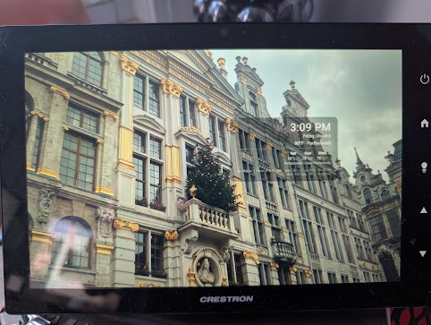

# Photo Frame Server

Turn any Crestron TSW panel, wall tablet, or old laptop into a digital photo frame. Just point a browser at this server and it displays your photos full-screen with fade transitions, a bouncing clock overlay, and optional weather.

No Home Assistant required. No special software on the display device. If it has a web browser, it works.



## What You Need

- A computer to run the server (any Linux/Mac/Windows machine on your network — a Raspberry Pi works great)
- Docker installed on that computer ([install guide](https://docs.docker.com/get-docker/))
- A folder of photos (jpg, png, webp — any mix, any filenames)
- A display device with a browser (Crestron panel, tablet, old laptop, etc.)

## Step-by-Step Setup

### 1. Get the code

```bash
git clone https://github.com/mikecirioli/crestron-ha-launcher.git
cd crestron-ha-launcher/photoframe-server
```

Or just download the two files you need: `server.py` and `Dockerfile`.

### 2. Put your photos in a folder

Any folder on the server machine. For example:

```bash
mkdir -p /home/youruser/photos
# Copy or move your photos into this folder
cp /path/to/your/vacation-pics/*.jpg /home/youruser/photos/
```

File names don't matter — `IMG_2024.jpg`, `beach.png`, `1.webp` are all fine. Any mix of formats. Just dump them in one folder.

### 3. Edit docker-compose.yaml

Open `docker-compose.yaml` in a text editor and change the photos path to match your folder:

```yaml
services:
  photoframe:
    build: .
    container_name: photoframe-server
    restart: unless-stopped
    ports:
      - "8099:8099"
    volumes:
      - /home/youruser/photos:/media:ro    # <-- change this to YOUR photos folder
    environment:
      - REFRESH=30        # seconds between photos
      - TITLE=            # optional text on the overlay (e.g. "Family Photos")
```

The format is `/path/on/your/computer:/media:ro` — only change the part before the first colon.

### 4. Build and start the server

```bash
docker compose up -d
```

This builds the container image (takes ~30 seconds the first time) and starts the server in the background. It will automatically restart if the machine reboots.

### 5. Test it

Open a browser on any device on your network and go to:

```
http://<server-ip>:8099/
```

Replace `<server-ip>` with the IP address of the machine running Docker. To find it:

```bash
# On the server machine:
hostname -I | awk '{print $1}'
```

You should see a full-screen photo with a clock overlay. The photo changes every 30 seconds with a fade transition. The clock slowly drifts around the screen to prevent burn-in.

### 6. Point your display at it

**Crestron TSW Panel — EMS Mode (simplest):**

From the panel console (via SSH or Toolbox):

```
EMS <server-ip>:8099
REBOOT
```

That's it. The panel boots straight into the photo frame.

> **Note:** EMS mode enables aggressive browser caching which increases SD card writes. For a panel running 24/7, consider UserProject mode with `BROWSERCACHE DISABLE` to extend SD card life (see the [main project README](../README.md)).

**Crestron TSW Panel — UserProject/Browser Mode:**

```
BROWSEROPEN http://<server-ip>:8099/
```

Or set it as the home page so it loads on every boot:

```
BROWSERHOMEPAGE http://<server-ip>:8099/
```

**Any other device:**

Open `http://<server-ip>:8099/` in a browser. For a kiosk/full-screen experience, use the browser's full-screen mode (usually F11) or a kiosk app.

## Adding or Removing Photos

Just add or remove files from your photos folder. The server detects changes automatically — no restart needed.

```bash
# Add new photos
cp new-photo.jpg /home/youruser/photos/

# Remove a photo
rm /home/youruser/photos/old-photo.jpg
```

## Endpoints

| Endpoint | Returns | Use Case |
|----------|---------|----------|
| `/` | Full-screen HTML page with fade transitions and clock overlay | Point any browser or kiosk at this |
| `/random` | A random image file with proper content-type | API endpoint for custom dashboards |
| `/random?w=1280&h=800` | Random image resized on the fly | Bandwidth-friendly for constrained devices |
| `/camera/list` | JSON array of available camera names | Roku/Crestron screensaver camera discovery |
| `/camera/<name>` | Live JPEG snapshot from a camera (~230ms, full res) | Camera screensaver, near-realtime frames |
| `/frigate/*` | Proxied Frigate API (requires `FRIGATE_URL` env var) | Detection strip in Panel Lite |
| `/health` | `ok` | Container/load balancer health check |

## Configuration

All configuration is via environment variables in `docker-compose.yaml`:

| Variable | Default | Description |
|----------|---------|-------------|
| `PHOTO_DIR` | `/media` | Directory inside the container (you shouldn't need to change this) |
| `PORT` | `8099` | Listen port |
| `REFRESH` | `30` | Seconds between photo changes |
| `TITLE` | _(empty)_ | Optional text shown in the clock overlay |
| `FRIGATE_URL` | _(empty)_ | Frigate base URL for detection proxy (e.g. `http://192.168.1.207:5000`). When set, `/frigate/*` requests are proxied to Frigate with CORS headers, enabling the Panel Lite detection strip to fetch events cross-origin. |
| `GO2RTC_URL` | _(empty)_ | go2rtc base URL (e.g. `http://192.168.1.207:1984`). Enables `/camera/list` discovery from go2rtc streams. |
| `CAMERA_IDLE` | `30` | Seconds with no requests before a camera polling thread shuts down. |

## Optional: Weather Overlay (requires Home Assistant)

If you have Home Assistant, you can add current weather and a 3-day forecast to the clock overlay by adding URL parameters:

```
http://<server-ip>:8099/?ha_url=http://homeassistant.local:8123&token=YOUR_LONG_LIVED_TOKEN
```

| Parameter | Description |
|-----------|-------------|
| `ha_url` | Home Assistant base URL |
| `token` | HA long-lived access token (create at Profile → Security → Long-Lived Access Tokens) |
| `weather` | Weather entity ID (default: `weather.forecast_home`) |

Without these parameters, the overlay shows just the clock and date — no HA connection needed.

## On-the-Fly Resize

The `/random` endpoint supports optional resize parameters:

```
/random?w=1280&h=800
```

This resizes the image to fit within the given dimensions (preserving aspect ratio), applies EXIF rotation corrections, and serves the result. Original files are never modified. Useful for saving bandwidth when serving to constrained devices.

## Running Without Docker

If you prefer not to use Docker:

```bash
# Install Python 3 if you don't have it
# Install Pillow (optional — needed for on-the-fly resize)
pip install Pillow

# Start the server
PHOTO_DIR=/path/to/your/photos python3 server.py
```

The server runs on port 8099 by default. Set the `PORT` environment variable to change it.

## Stopping / Restarting

```bash
# Stop the server
docker compose down

# Restart (e.g. after changing config)
docker compose restart

# View logs
docker compose logs -f

# Rebuild after updating server.py
docker compose up -d --build
```

## Supported Image Formats

jpg, jpeg, png, webp, gif, bmp — any mix in the same directory.

## Integration with Panel Lite Dashboard

If you're running the [Panel Lite](../) Home Assistant dashboard:

- **Screensaver photos**: Set `PHOTOFRAME_URL` in `panel-lite-config.js` to `http://<server-ip>:8099`. The screensaver fetches random photos via `/random?w=1280&h=800`.
- **Detection strip**: Set `FRIGATE_URL` env var in docker-compose and `FRIGATE_URL` in `panel-lite-config.js` to `http://<server-ip>:8099/frigate`. The detection strip polls `/frigate/api/events` for the most recent person detections across all cameras, with thumbnails served via `/frigate/api/events/<id>/thumbnail.jpg`. The proxy adds CORS headers so the browser can fetch cross-origin.
